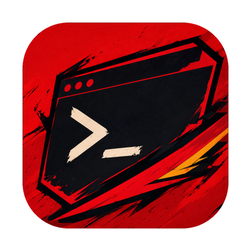
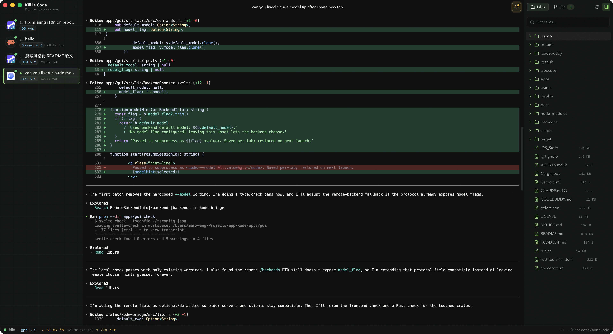
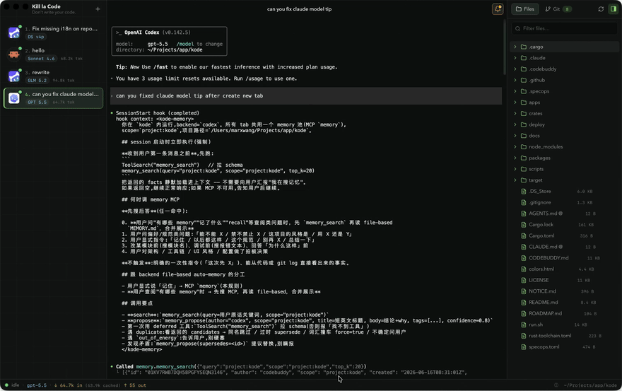
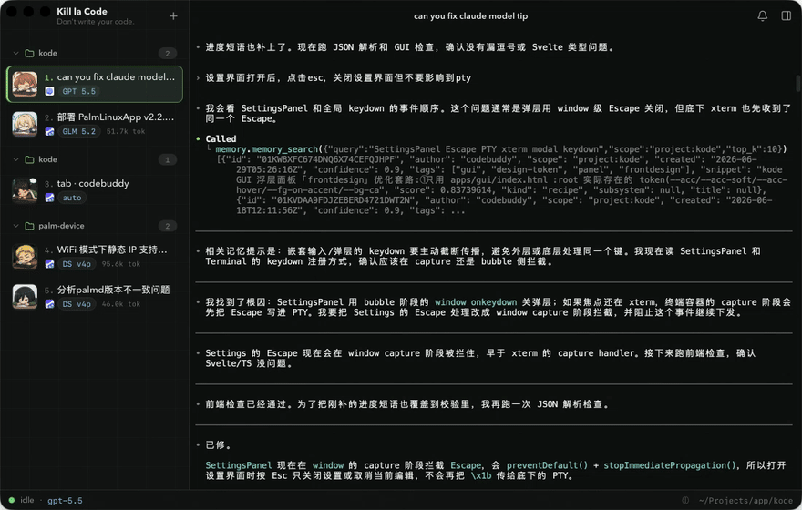
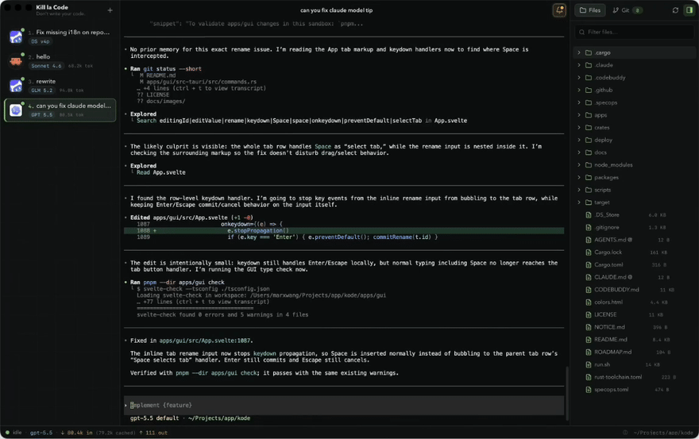
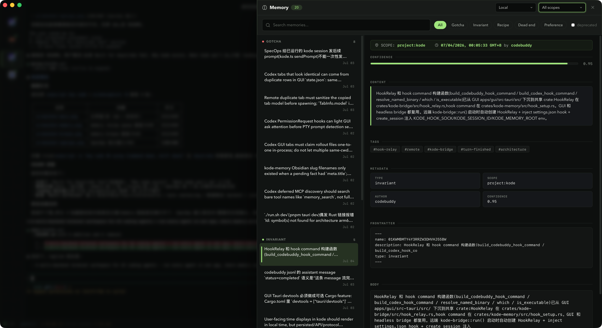
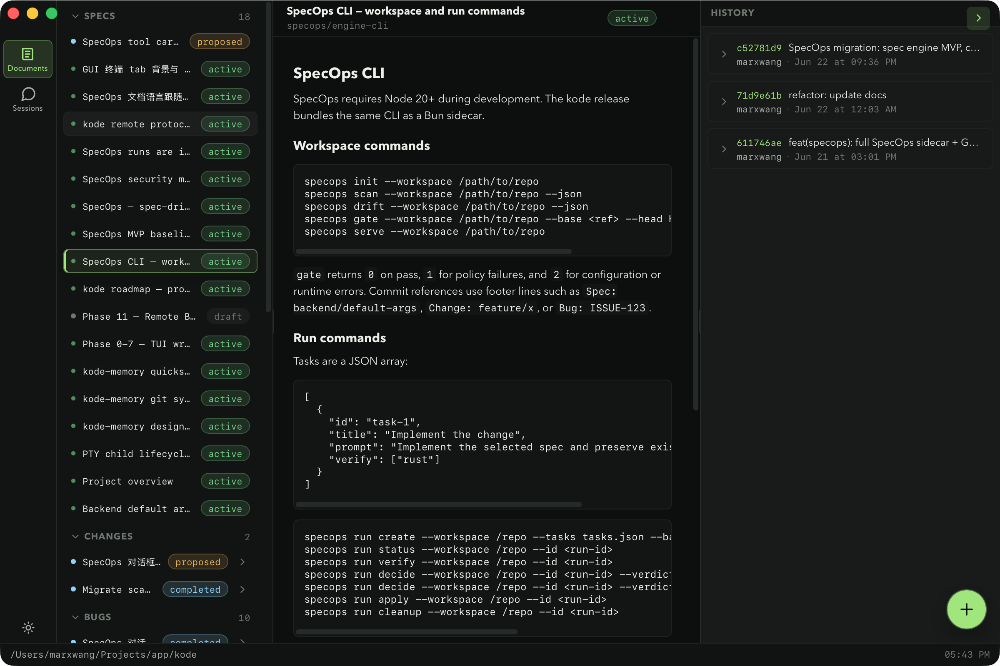
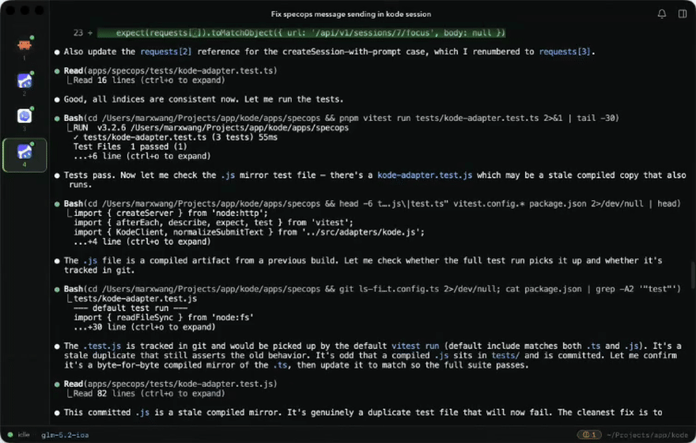

<p align="center">
  
</p>

<h1 align="center">kode</h1>

<p align="center">
  <em>Named after <strong>Kill la Code</strong> — a nod to <strong>Kill la Kill</strong>.</em>
</p>

<p align="center">
  A multi-backend terminal workspace for AI coding agents.<br />
  Run CodeBuddy, Claude, Codex, Gemini, and more in one native app; share memory across sessions; keep local and remote agents in sync over SSH.
</p>

<p align="center">
  <a href="./LICENSE"></a>
  <a href="#install"></a>
  <a href="https://v2.tauri.app"></a>
</p>

<p align="center"><strong>Status:</strong> early access. Expect rough edges.</p>

<p align="center">
  
</p>

---

## One app, every agent.

`codebuddy`, `claude`, `codex`, `gemini`, `opencode`, `amp`, `cursor`, `copilot`, `grok`, `antigravity`, `kimi`, `kiro`, `droid`, `pi` — fifteen built-in backends, data-driven from `~/.config/kode/config.toml`. Pick one per tab, or add your own. Each tab is a real PTY running the real CLI, not a wrapper.

The backend chooser is a cold snapshot at startup; manage backends from `Settings → Backends` and restart to pick up new ones. The `codebuddy` / `claude` / `codex` defaults ship with no positional args — positional first tokens get treated as initial prompts by the CLI, so this is regression-tested.

No accounts, no telemetry, no cloud sync. Your code, tokens, and conversations stay on your machine.

<p align="center">
  
</p>
<p align="center"><sub>Pick a backend, choose a working directory, and a live session spins up in a new tab.</sub></p>

Every backend gets an icon in the chooser and sidebar. Drop in any PNG in `Settings → Backends` to create a custom backend avatar, or build a small animated avatar gallery from your own generated image sequence:

```text
# macOS
~/Library/Application Support/kode/avatars/gallery/<avatar-id>/frame-01.png ... frame-04.png

# Linux
~/.config/kode/avatars/gallery/<avatar-id>/frame-01.png ... frame-04.png
```

For state-aware avatars, split the frames by session state. Each state can contain one 4-frame set directly, or multiple variants (`01`, `02`, ...) that kode will cycle through:

```text
avatars/gallery/<avatar-id>/idle/frame-01.png ... frame-04.png
avatars/gallery/<avatar-id>/running/01/frame-01.png ... frame-04.png
avatars/gallery/<avatar-id>/running/02/frame-01.png ... frame-04.png
avatars/gallery/<avatar-id>/awaiting/frame-01.png ... frame-04.png
avatars/gallery/<avatar-id>/error/frame-01.png ... frame-04.png
```

Set `KODE_AVATAR_DIR=/path/to/avatars` while developing to load a different avatar root without touching your app config directory.

<p align="center">
  
</p>

## Memory that survives the session.

Agents forget. `kode` doesn't. A shared memory pool (`~/.kode-memory/`) is exposed to every agent through an MCP server (`kode-memory-mcp`). Agents `memory_propose`; you review in the GUI (`⌘⇧M`); approved facts land in a retrieval pool that every subsequent agent — across tabs, sessions, and backend types — can `memory_search` from.

<p align="center">
  
</p>
<p align="center"><sub>An agent proposes a fact, you approve it in the review queue, and the next session recalls it.</sub></p>

- **Propose + review model.** Agents never write facts directly. No pool poisoning.
- **Energy budget.** Each agent gets a daily propose quota; rejects cost extra. Tunable in `budget.json`.
- **SQLite FTS5 + trigram tokenizer.** Chinese search works out of the box.
- **Obsidian-compatible vault.** Facts live as `<ULID>--<slug>.md` with frontmatter; open the same folder in Obsidian for graph view, backlinks, and Dataview.
- **Git sync.** Decentralized cross-machine sync via plain `git` — no central server, union merge on `facts/*.md`, energy/metrics stay local.

`⌘⇧B` opens the browse panel for the approved pool; the status bar shows pending count and 7-day accept rate.

<p align="center">
  
</p>
<p align="center"><sub>The browse panel (⌘⇧B) — search and inspect the approved fact pool.</sub></p>

## SpecOps: specs that run themselves.

Specs aren't just docs — they're runnable. `.specops/specs/*.md` files become isolated git worktrees bound to an immutable base commit, executed in the platform cache directory without polluting your main workspace. Each spec declares `verifies:` and `paths:` so a change to `crates/kode-core` automatically runs the specs that depend on it. This README's own roadmap, memory design, and remote protocol are all SpecOps-managed.

<p align="center">
  
</p>
<p align="center"><sub>The SpecOps console (⌘S) runs specs in an isolated worktree, never on your main branch.</sub></p>

Open the SpecOps console with `⌘S` and pick a Git workspace. The TypeScript/Bun sidecar runs in the GUI's process; specs land in an isolated worktree, never on your main branch.

## Remote and mobile, first-class.

`crates/kode-bridge` is a standalone axum HTTP/WS server — run it headless on a dev box, pair from the desktop GUI, or connect the Flutter companion app (`apps/mobile`) by scanning a QR code. The protocol is documented and verified by 173 cross-implementation tests (115 Rust + 58 Go).

SSH-tunneled remote tabs come built-in: `ssh -N -L` brings a no-public-IP devcloud server into your local tab list without Tailscale. Run agents on a beefy remote box; read the output on your laptop.

<p align="center">
  
</p>
<p align="center"><sub>An SSH tunnel brings a remote box into a local tab — PTY bytes stream back over the bridge.</sub></p>

## Built different.

- **Tauri 2 + xterm.js + Svelte 5.** A native Rust backend drives the PTY and session kernel. xterm.js is the same engine VSCode, Cursor, and GitHub Codespaces use.
- **PTY byte path is coalesced in Rust (~8ms) and pushed through a Tauri v2 Channel — not `emit`.** Each tab is one xterm.js instance; background tabs keep feeding, switching back is zero-latency.
- **Backend definitions are data-driven.** Defaults live in `crates/kode-core/src/config.rs`; override per-backend in `~/.config/kode/config.toml`. No `if key == "codebuddy"` branches in business logic.
- **Status bar reads from CLI jsonl files, not PTY scraping.** `codebuddy` / `claude` / `codex` each write their own metadata; kode tails them.
- **Cross-platform core.** `kode-core`, `kode-bridge`, `kode-memory` are pure Rust; GUI is Tauri 2 (macOS + Linux); mobile is Flutter (iOS + Android).

## Install

### Download

Pre-built binaries are coming with the first public release. For now, build from source — it's fast (~30 s incremental Rust, ~13 s release).

### Build from source

```bash
git clone <repo-url> kode
cd kode
./run.sh dev        # Vite + Tauri dev, opens GUI
```

`./run.sh` handles Node version pinning, pnpm deps, SpecOps sidecar build, Tauri resource bundling, and macOS signing fallback. Run `./run.sh help` for the full list of entrypoints.

Common commands:

```bash
./run.sh dev            # GUI dev (Vite + Tauri)
./run.sh app            # Build release .app (ad-hoc signed without Developer ID)
./run.sh open           # Open the current bundle (kills old instance first)
./run.sh test           # Rust tests (PTY tests run single-threaded)
./run.sh check          # cargo check + svelte-check + cargo test
./run.sh build-release  # Optimized release build
./run.sh clippy         # Lint
./run.sh fmt            # Format
```

### macOS Gatekeeper

Without a Developer ID certificate, `./run.sh app` produces an ad-hoc signed `.app`. First launch:

1. Right-click → **Open** → **Open anyway**. Or
2. `xattr -dr com.apple.quarantine /path/to/kode.app`. Or
3. System Settings → Privacy & Security → scroll down → **Open Anyway**.

On Sequoia the button sometimes doesn't appear until you've tried to launch once and waited ~30 s.

## Workspace layout

```
kode/
├── crates/
│   ├── kode-core/       PTY, Session, Config, CoreEvent — the pure Rust kernel
│   ├── kode-bridge/     axum HTTP/WS bridge, semantic events, headless bin
│   └── kode-memory/     SQLite + markdown store, MCP server, CLI, git sync
├── apps/
│   ├── gui/             Tauri 2 + Svelte 5 + xterm.js — the desktop main line
│   ├── mobile/          Flutter companion (iOS + Android)
│   └── specops/         TypeScript/Bun SpecOps sidecar + Web console
├── .specops/specs/      specs (roadmap, protocol, memory, SpecOps)
├── deploy/              remote memory bridge build/deploy scripts
└── docs/                smoke scripts, screenshots, demo videos
```

## Configuration

Default at `~/.config/kode/config.toml`. Backend definitions are data-driven — defaults live in [`crates/kode-core/src/config.rs`](./crates/kode-core/src/config.rs), override per-backend in the config file. Memory root is `~/.kode-memory/` (override with `KODE_MEMORY_ROOT`). Bridge token and GUI state persist to `~/.kode/state.json`.

## Documentation

- [`CODEBUDDY.md`](./CODEBUDDY.md) — project rules, constraints, known gotchas (start here)
- [`.specops/specs/roadmap.md`](./.specops/specs/roadmap.md) — phases and decision log
- [`.specops/specs/memory-design.md`](./.specops/specs/memory-design.md) — memory architecture
- [`.specops/specs/remote-protocol.md`](./.specops/specs/remote-protocol.md) — REST/WS protocol

## Acknowledgements

- [Tauri 2](https://v2.tauri.app) — the app shell
- [xterm.js](https://github.com/xtermjs/xterm.js) — terminal rendering
- [Svelte 5](https://svelte.dev) — frontend
- [lobe-icons](https://github.com/lobehub/lobe-icons) — backend brand icons (MIT)
- Every AI CLI that kode runs — this project wouldn't exist without them

## License

[Apache-2.0](./LICENSE). Third-party notices in [`NOTICE.md`](./NOTICE.md).
